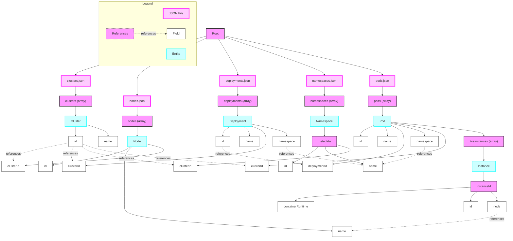

# Stackrox Data Processing Manual

## 1. Data Retrieval Script

### Purpose
This script retrieves data from the Stackrox API for various Kubernetes resources.

### Endpoints Used
- `/v1/clusters`: Retrieves information about all clusters
- `/v1/nodes/{clusterId}`: Retrieves node information for each cluster
- `/v1/namespaces`: Retrieves information about all namespaces
- `/v1/deployments`: Retrieves information about all deployments
- `/v1/pods`: Retrieves information about all pods

### Process
1. The script uses asynchronous HTTP requests to fetch data from each endpoint.
2. Pagination is implemented where necessary (e.g., for deployments and pods).
3. The retrieved data is saved into separate JSON files:
   - `clusters.json`
   - `nodes.json`
   - `namespaces.json`
   - `deployments.json`
   - `pods.json`

### Key Components
- Uses `aiohttp` for asynchronous HTTP requests
- Implements retry logic for failed requests
- Handles API authentication
- Implements logging for monitoring and debugging

## 2. Data Combination Script

### Purpose
This script combines the separate JSON files into a single, hierarchical structure that represents the entire Kubernetes environment.

### Input Files
- `clusters.json`
- `nodes.json`
- `namespaces.json`
- `deployments.json`
- `pods.json`

### Process
1. Load data from all JSON files.
2. Create a nested dictionary structure representing the Kubernetes hierarchy.
3. Process each entity type (clusters, nodes, namespaces, deployments, pods).
4. Place each entity in its appropriate place in the hierarchy.
5. Save the combined data to a new JSON file.

### Key Components
- Uses nested defaultdict for efficient data structuring
- Implements error handling for file loading
- Provides statistics on the processed data

## 3. JSON Parsing and Relationship Diagram



### Diagram Explanation
- **JSON Files**: Represented by pink boxes with thick purple borders. These are the main data sources.
- **Entities**: Represented by light blue boxes with blue borders. These are the main objects within each JSON file.
- **Fields**: Represented by white boxes with thin black borders. These are the individual properties of each entity.
- **References**: Represented by dotted lines. These show how fields in one entity reference fields in another entity.

### Key Relationships
- Cluster `id` is referenced by:
  - Node `clusterId`
  - Deployment `clusterId`
  - Namespace `clusterId` (in metadata)
  - Pod `clusterId`
- Deployment `id` is referenced by Pod `deploymentId`
- Namespace `name` is referenced by:
  - Deployment `namespace`
  - Pod `namespace`
- Node `name` is referenced by Pod `node` (in liveInstances)

## 4. Final Data Structure

The combined data creates a hierarchical JSON structure:

```json
{
  "cluster_id_1": {
    "info": {
      "name": "cluster_name",
      "type": "cluster_type"
    },
    "nodes": [
      {
        "id": "node_id",
        "name": "node_name",
        "labels": {},
        "taints": []
      }
    ],
    "namespaces": {
      "namespace_name": {
        "id": "namespace_id",
        "labels": {},
        "annotations": {},
        "deployments": {
          "deployment_id": {
            "info": {
              "name": "deployment_name",
              "created": "creation_timestamp"
            },
            "pods": [
              {
                "id": "pod_id",
                "name": "pod_name",
                "node": "node_name",
                "containers": [
                  {
                    "name": "container_name",
                    "id": "container_id",
                    "runtime": "container_runtime"
                  }
                ]
              }
            ]
          }
        },
        "standalone_pods": []
      }
    }
  }
}
```

This structure allows for efficient querying and analysis of the Kubernetes environment, maintaining all relationships between different entities while providing a clear hierarchical view.

## 5. Usage

1. Run the data retrieval script to fetch data from the Stackrox API and save it to JSON files.
2. Run the data combination script to process these JSON files and create the combined, hierarchical JSON structure.
3. The resulting JSON file can be used for further analysis, reporting, or visualization of the Kubernetes environment.

This process provides a comprehensive view of the Kubernetes infrastructure, from individual resources to their relationships and hierarchy within the system.
